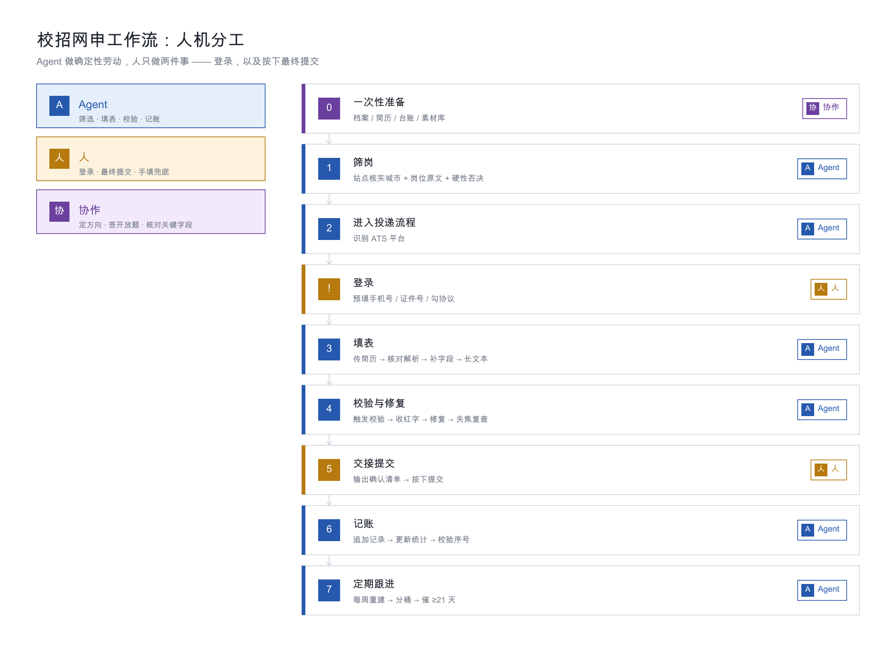

# 端到端 Runbook



> 这是整套 SOP 的**执行清单**。从零开始投一家公司，按这个顺序走。
> 每一步都标注了「谁做」：🤖 Agent / 👤 人 / 🤝 协作

---

## 阶段 0：一次性准备（只做一次）

| # | 动作 | 谁做 | 产出 |
|---|---|---|---|
| 0.1 | 建立个人档案 JSON | 🤝 | `candidate-profile.json`（含基本信息、教育、实习、项目、技能、自述） |
| 0.2 | 准备 2–3 份不同方向的简历 PDF | 👤 | 每份都验证过 ATS 可解析（有可选文本层） |
| 0.3 | 准备作品集 PDF（如有） | 🤖 | 见 [05-document-generation.md](05-document-generation.md) |
| 0.4 | 准备开放题素材库 | 🤝 | 见 [templates/open-questions](../templates/open-ended-questions.md) |
| 0.5 | 建立投递台账（三张表 + 总表进度列） | 🤖 | 见 [04-data-management.md](04-data-management.md) |
| 0.6 | 把「人机分工协议」和「止损红线」读一遍 | 👤 | 见 [01-methodology.md](01-methodology.md) |

> ⚠️ 0.1 和 0.2 里的文件**绝不能进 Git**。用 `.gitignore` 挡住。

---

## 阶段 1：筛岗（每家公司）

| # | 动作 | 谁做 | 通过标准 |
|---|---|---|---|
| 1.1 | 打开公司招聘页，确认是校招还是社招 | 🤖 | — |
| 1.2 | 用站点筛选器筛「目标城市 + 目标职能方向」 | 🤖 | — |
| 1.3 | **到站点核实城市**（不信二手表格） | 🤖 | 城市筛选里真的有目标城市 |
| 1.4 | 读岗位原文：学历、地点、职责、任职要求 | 🤖 | 不满足硬性条件直接跳过 |
| 1.5 | 判断匹配度：岗位要求 vs 我的经历 | 🤝 | 至少 3 条要求能对上 |
| 1.6 | 记录结论（投 / 跳过 + 具体原因） | 🤖 | 写进总表的「投递进度」列 |

### 硬性否决（命中即跳过）

```
□ 要求硕士 / 博士
□ 工作地点不含目标城市
□ 岗位是"运营/销售/内容"，不是产品经理方向
□ 岗位是硬件产品工程师（要微电子/机械背景）
□ 只有"招聘类别"没有"具体岗位名"，且类别里没有产品方向
```

### 需要谨慎判断的

```
△ 顶尖人才计划 → 通常要求硕博，先看学历要求
△ 实习岗位 → 看时间投入要求（很多要求 6 个月全职）
△ 产品市场岗（PMM）→ 是市场方向，不是产品经理
△ 解决方案/售前岗 → 是售前方向，技术要求可能是硬件
```

---

## 阶段 2：进入投递流程

| # | 动作 | 谁做 | 备注 |
|---|---|---|---|
| 2.1 | 点「投递」/「申请职位」 | 🤖 | 注意可能有限制（如"只可投 1 个职位"） |
| 2.2 | 检查还剩几个投递名额 | 🤖 | 名额少时先对比完所有岗位再决定 |
| 2.3 | 识别平台类型 | 🤖 | 见 [02-platforms/README.md](02-platforms/README.md) |

### ⛔ 遇到登录 → 停下

| 动作 | 谁做 |
|---|---|
| 预填手机号 / 证件号 | 🤖 |
| 勾选隐私协议 | 🤖 |
| **输入图形验证码 / 短信码 / 扫码** | 👤 |
| 点「登录」 | 👤 |

**Agent 不做的事**：识别图形验证码、模拟登录。

---

## 阶段 3：填表

| # | 动作 | 谁做 | 备注 |
|---|---|---|---|
| 3.1 | **上传简历触发自动解析** | 🤖 | 这一步能省 80% 工作量 |
| 3.2 | **逐条核对解析结果** | 🤖 | ⚠️ 必做，见下表 |
| 3.3 | 补齐结构化字段（下拉/日期/单选） | 🤖 | 按平台解法 |
| 3.4 | 填多段经历（实习/项目/校园/获奖） | 🤖 | 用简历原文完整版 |
| 3.5 | 填长文本（职责/描述/自述） | 🤖 | 200–450 字 |
| 3.6 | 答复开放性问题 | 🤝 | 素材库 + 按岗位微调 |
| 3.7 | 上传附件（作品集等） | 🤖 | 失败则转人工 |

### 3.2 解析结果核对清单（必做）

| 检查项 | 常见错误 |
|---|---|
| **专业名称** | 被识别成完全不相关的专业 |
| **实习公司/职位** | 公司名和职位名写反 |
| **职位名** | 混进部门名 |
| **时间段** | 多段经历串行、漏段 |
| **是否有工作/项目经历** | 被勾成"没有"，导致已填内容失效 |
| **创业项目位置** | 被塞进"工作经历"而不是"项目经历" |
| **英语水平** | 被同步成"未参加" |

### 3.3 组件的处理顺序

```
文本输入 → React setter（快）
下拉选择 → 真实 UI 点击（不要直调，尤其 Moka）
单选组   → 鼠标事件序列
日期     → 直调 onChange（北森老版）或真实点击（其他）
上传     → 本地 CORS 服务 + fetch 构造 File
```

---

## 阶段 4：校验与修复

| # | 动作 | 谁做 | 备注 |
|---|---|---|---|
| 4.1 | 点「预览并提交」触发真实校验 | 🤖 | ⛔ **绝不点最终"确认提交"** |
| 4.2 | 收集全部缺项红字 | 🤖 | 见方法论第三节 |
| 4.3 | 逐项修复 | 🤖 | — |
| 4.4 | 失焦后重新扫描一轮 | 🤖 | 排除渲染残留 |
| 4.5 | 单字段试满 4 次 → 转人工 | 🤖 | 输出字段名 + 应填值 |
| 4.6 | 检查授权/隐私协议是否勾选 | 🤖 | 漏勾会被拦截 |
| 4.7 | 检查有无隐藏动作项（性格测试等） | 🤖 | 见下 |

### 4.7 隐藏动作项

**投递完成后，到「应聘记录 / 我的投递」页面再看一遍。**

有的平台会挂额外的待办，例如：

- 性格测试「点击参加」
- 补充材料上传
- 确认投递意向

**这些不完成，流程会一直卡着。** 实战中就有因为漏了性格测试而让简历停在筛选环节的情况。

---

## 阶段 5：交接提交

| # | 动作 | 谁做 |
|---|---|---|
| 5.1 | 输出一份「提交前确认清单」 | 🤖 |
| 5.2 | 核对清单 → **点最终提交** | 👤 |
| 5.3 | 记录提交结果（candidateId / 成功提示） | 🤖 |

### 5.1 提交前确认清单模板

```
【提交前请核对】
岗位：<完整岗位名>（<地点>）
简历：<文件名>
系统：<平台>

关键字段：
  姓名 / 手机 / 邮箱
  学历 / 学校 / 专业 / 毕业时间
  N 段实习 · N 个项目

⚠️ 需要你特别留意：
  - <显示为空但值已写入的字段>
  - <程序化填不进去、已手填的字段>
  - <解析结果可疑的字段>
```

---

## 阶段 6：记账

| # | 动作 | 谁做 |
|---|---|---|
| 6.1 | 追加到「投递记录汇总」 | 🤖 |
| 6.2 | 更新统计区（总投递数 / 方向分布） | 🤖 |
| 6.3 | 重建「投递进度跟踪」和「本周跟进清单」 | 🤖 |
| 6.4 | 更新总表的「投递进度」列 | 🤖 |
| 6.5 | **校验序号连续性** | 🤖 |

### 6.1 记录内容

```
序号 | 公司 | 行业 | 岗位（含地点） | 方向 | 日期 | 简历版本 | 渠道（含 candidateId）
```

**candidateId / jobId 必须记** —— 三个月后查进度全靠它。

---

## 阶段 7：定期跟进

### 每周一次

| 动作 | 说明 |
|---|---|
| 重建进度跟踪表 | 重新计算等待天数 |
| 看分桶分布 | 🔴 几家、🟡 几家 |
| 对 🔴（≥21 天）的做跟进 | 补充新信息，不是催 |
| 更新总表状态 | 笔试/面试邀请来了就标上 |

### 跟进质量

| ✅ 好的跟进 | ❌ 差的跟进 |
|---|---|
| 补充新信息（新项目、新成绩、作品集链接） | "请问我的简历看了吗" |
| 表达持续兴趣 + 具体理由 | 群发模板 |
| 通过内推人 / HR 渠道 | 反复轰炸同一渠道 |

---

## 附：完整流程图

```
┌─────────────┐
│ 0. 一次性准备 │  档案 / 简历 / 台账 / 素材库
└──────┬──────┘
       ↓
┌─────────────┐
│ 1. 筛岗      │  站点核实城市 + 岗位原文 + 硬性否决
└──────┬──────┘
       ↓  不匹配 → 记「跳过原因」→ 回 1
┌─────────────┐
│ 2. 进流程    │  识别平台
└──────┬──────┘
       ↓
   ⛔ 登录 ──→ 👤 人做
       ↓
┌─────────────┐
│ 3. 填表      │  传简历 → 核对解析 → 补字段 → 长文本
└──────┬──────┘
       ↓
┌─────────────┐
│ 4. 校验      │  触发校验 → 收红字 → 修复 → 失焦复查
└──────┬──────┘
       ↓  仍有填不了 → 👤 手填清单
┌─────────────┐
│ 5. 交接提交  │  确认清单 → 👤 按下提交
└──────┬──────┘
       ↓
┌─────────────┐
│ 6. 记账      │  追加记录 → 更新统计 → 校验序号
└──────┬──────┘
       ↓
┌─────────────┐
│ 7. 定期跟进  │  每周重建 → 分桶 → 催 🔴
└─────────────┘
```
