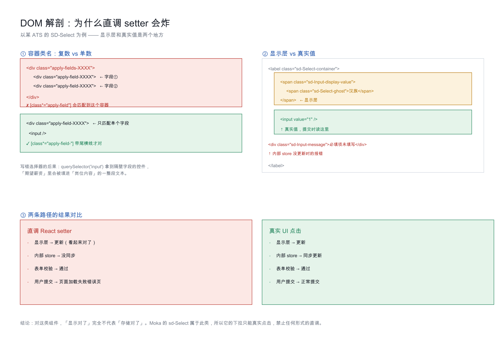

# Moka 网申表单

> Moka 是互联网公司和独角兽最常用的 ATS。它的前端是自研的 **SD 设计系统**（`sd-*` 类名）。
> **最大的坑：用 React setter / onChange 直调下拉会污染内部 store，导致用户提交时炸出错误页。**

## 目录

- [一、识别](#一识别)
- [二、⛔ 头号铁律：禁止直调下拉](#二-头号铁律禁止直调下拉)
- [三、⛔ 第二条铁律：字段选择器必须带尾横线](#三-第二条铁律字段选择器必须带尾横线)
- [四、正确的下拉操作流程](#四正确的下拉操作流程)
- [五、SD 组件对照表](#五sd-组件对照表)
- [六、单选组的鼠标事件序列](#六单选组的鼠标事件序列)
- [七、滚动定位与坐标失效](#七滚动定位与坐标失效)
- [八、踩坑实录](#八踩坑实录)

---

## 一、识别

```js
document.querySelectorAll('[class*="sd-Input-"], [class*="sd-Select-"]').length > 0
document.querySelectorAll('[class*="apply-field-"]').length > 0
```

URL 特征：`app.mokahr.com/campus-recruitment/<company>/<id>`

页面特征：
- 顶部 tab + 左侧锚点导航
- 右上角「暂存」按钮
- 底部「预览并提交」
- 支持上传简历自动解析

---



## 二、⛔ 头号铁律：禁止直调下拉

### 现象

用 React 原生 setter 或 fiber `onChange` 直调 Moka 的 `sd-Select` 下拉：

- ✅ 界面上显示正确
- ✅ 表单校验通过
- ❌ **用户点最终提交时，Moka 返回「页面加载失败」错误页**（错误码形如 `20260921-1936-e040c-release`）

### 为什么

Moka 的 SD-Select **只在 display 层更新**，内部 store 没同步。提交时服务端校验发现客户端状态不一致 → 报错。

### 证据

实战中两家中型公司因此投递失败。表现是：

```
校验时：字段显示有值，但服务端返回「必填项未填写」
提交时：页面加载失败错误页
```

### 正确做法

**一律用真实 UI 交互。** 流程见第四节。

**如果下拉点不开 → 直接停下转人工。** 不要"试试看 setter 行不行"—— 试了就可能炸掉用户的一次投递机会。

### React 直调还能不能用

可以，但**只用在这两个位置**：

1. **文本输入框 / textarea**（`sd-Input`）—— 不受此限制
2. **隐藏按钮的 onClick** —— 如某些 visibility:hidden 的按钮

**`sd-Select` 一族（下拉、日期）绝对不要直调。**

---

## 三、⛔ 第二条铁律：字段选择器必须带尾横线

### 现象

```js
// ❌ 错误写法
document.querySelectorAll('[class*="apply-field"]')
```

会匹配到外层的 `apply-fields-xxx`（**复数、容器级**），一个容器里装着 2 个字段。
于是 `container.querySelector('input')` 拿到的可能是**隔壁字段的控件**。

**实战事故**：「期望薪资」输入框里被填进了「期望从事的岗位内容」的一大段文本。

### 正确写法

```js
// ✅ 正确写法：带结尾横线，只匹配单个字段
document.querySelectorAll('[class*="apply-field-"]')
```

Moka 的类名规则：

| 类名 | 层级 |
|---|---|
| `apply-fields-XXXX` | **容器**（复数，装多个字段） |
| `apply-field-XXXX` | **单个字段** |

`[class*="apply-field"]` 会同时命中两者，`[class*="apply-field-"]` 只命中后者。

---

## 四、正确的下拉操作流程

```js
async function pickMokaSelect(fieldLabel, optionText) {
  const sleep = ms => new Promise(r => setTimeout(r, ms));

  // 1) 按 label 精确找到字段容器
  const field = [...document.querySelectorAll('[class*="apply-field-"]')]
    .find(f => {
      const t = f.querySelector('[class*="title-"]');
      return t && t.innerText.trim() === fieldLabel;
    });
  if (!field) return { err: 'field not found' };

  // 2) 滚动到视野内
  const input = field.querySelector('input');
  input.scrollIntoView({ block: 'center' });
  await sleep(500);

  // 3) ▶ 真实鼠标点击（不是 .click()）
  const rect = input.getBoundingClientRect();
  await cua.click({ x: Math.round(rect.x + rect.width / 2),
                    y: Math.round(rect.y + rect.height / 2) });
  await sleep(1200);

  // 4) 在下拉面板里找到目标选项
  const panel = document.querySelector('[class*="sd-Select-menu"], [class*="sd-Dropdown-dropdown"]');
  if (!panel || panel.getBoundingClientRect().height === 0)
    return { err: 'panel not open → 转人工' };

  const option = [...panel.querySelectorAll('[class*="sd-Select-common-item"], [class*="item"]')]
    .find(o => o.innerText.trim() === optionText);
  if (!option) return { err: 'option not found: ' + optionText };

  // 5) ▶ 真实鼠标点击选项
  const orect = option.getBoundingClientRect();
  await cua.click({ x: Math.round(orect.x + orect.width / 2),
                    y: Math.round(orect.y + orect.height / 2) });
  await sleep(1000);

  // 6) 点空白处失焦，让错误提示刷新
  await cua.click({ x: 1060, y: 300 });
  await sleep(800);

  return { ok: true };
}
```

### 关键点

1. **用 `cua.click`（真实鼠标事件），不是 `element.click()`（合成事件）**
2. **每次点击前重新取坐标** —— 滚动后旧坐标会失效
3. **点完点空白处失焦** —— 让校验状态刷新

---

## 五、SD 组件对照表

| 类名 | 类型 | 填法 |
|---|---|---|
| `sd-Input-input` | 文本输入 | React 原生 setter 或真实键入都行 |
| `sd-Select-container` | 下拉 | **只能真实 UI 点击** |
| `sd-Select-common-item` | 下拉选项 | 真实 UI 点击 |
| `sd-Input-display-value` | 下拉的显示层 | 只读，不要试图改它 |
| `sd-Input-error` | 错误态容器 | 用于判断字段是否报错 |
| `sd-Dropdown-dropdown` | 弹出面板（portal） | 在 document 级别，不在字段内 |
| `sd-Tag-container` | 标签选择 | 真实 UI 点击 |

### 文本输入的正确写法

```js
// 方式 A：React 原生 setter（推荐，快且稳）
const setter = Object.getOwnPropertyDescriptor(HTMLInputElement.prototype, 'value').set;
setter.call(input, value);
input.dispatchEvent(new Event('input', { bubbles: true }));
input.dispatchEvent(new Event('change', { bubbles: true }));

// 方式 B：真实键入（setter 不生效时用）
await cua.click({ x, y });
await cua.type({ text: value });
```

### 修改已有值的正确写法

**直接 `cua.type` 会追加到已有值后面** —— 实战中把一个 11 位手机号写成了 22 位（原值重复叠加）。

```js
// ✅ 先清空再输入
const setter = Object.getOwnPropertyDescriptor(HTMLInputElement.prototype, 'value').set;
input.focus();
setter.call(input, '');
input.dispatchEvent(new Event('input', { bubbles: true }));
await cua.click({ x, y });
await cua.type({ text: value });
```

> `Meta+A` / `Ctrl+A` 在很多 React 输入框里**不生效**（不会全选），不要依赖它。

---

## 六、单选组的鼠标事件序列

有些 Moka 的 radio 用普通 `.click()` 点不动，需要完整事件序列：

```js
function realClick(el) {
  const r = el.getBoundingClientRect();
  const o = { bubbles: true, cancelable: true,
              clientX: r.x + r.width / 2, clientY: r.y + r.height / 2, button: 0 };
  ['pointerdown', 'mousedown', 'pointerup', 'mouseup', 'click']
    .forEach(t => el.dispatchEvent(new MouseEvent(t, o)));
}
```

**加 `pointerdown` / `pointerup` 是关键** —— 很多现代组件库监听的是 pointer 事件而不是 mouse 事件。

---

## 七、滚动定位与坐标失效

### 问题

Moka 的表单很长。用 `scrollIntoView` 定位后取坐标，**下次调用时页面可能已经滚回去了**，坐标失效。

### 解法：同一调用内完成「定位 → 取坐标 → 点击」

```js
// ❌ 错：分两次调用
const p = await evaluate(() => { el.scrollIntoView(); return getRect(el); });
await cua.click(p);   // 坐标已失效

// ✅ 对：一次调用内完成
const p = await evaluate(() => {
  el.scrollIntoView({ block: 'center' });
  const r = el.getBoundingClientRect();
  return { x: r.x + r.width / 2, y: r.y + r.height / 2 };
});
await cua.click(p);
```

### 批量操作时的坑

如果在一个循环里处理多个字段，**每次循环都要重新取坐标**：

```js
for (const [label, value] of FIELDS) {
  const pos = await evaluate(/* 定位 + 取坐标 */);
  await cua.click(pos);        // 用刚取的坐标
  await cua.type({ text: value });
}
```

---

## 八、踩坑实录

### 坑 1：下拉点不开

**可能原因**（按概率排序）：

1. 上一个下拉还没关 → 先 `Escape` 或点空白
2. 字段被其他元素遮挡（sticky header、浮动按钮）→ 滚动到视口中心
3. 点击坐标偏了 → 用 `getBoundingClientRect` 的中心点，不要用固定偏移

**排查顺序**：

```
点不动 → 截图看当前位置 → 确认元素可见性 → 换坐标重点 → 换鼠标事件序列 → 止损转人工
```

### 坑 2：搜索框需要点击后再输入

部分 SD-Select 下拉带搜索框，直接输入不会过滤：

```js
// 先点搜索框
await cua.click({ x: searchBoxX, y: searchBoxY });
await sleep(300);
// 再输入
await cua.type({ text: keyword });
await sleep(1200);   // 等过滤结果
```

### 坑 3：选项文案与预期不符

Moka 的选项文案经常是**长句**而非短标签，例如：

| 你以为的 | 实际的 |
|---|---|
| 是 | 接受海外常驻 |
| 否 | 不接受海外常驻 |
| 良好 | 无障碍商务沟通 |
| 本科 | 全日制本科（统招） |

**正确做法**：先点开下拉，**dump 全部可见选项文本**，再从里面选 —— 不要按预期文案硬找。

```js
const options = [...document.querySelectorAll('[class*="sd-Select-common-item"]')]
  .filter(o => o.getBoundingClientRect().height > 0)
  .map(o => o.innerText.trim());
console.log(options);
```

### 坑 4：错误提示是渲染残留

**现象**：字段显示有值了，但红色"必填项未填写"还在。

**原因**：错误提示要等失焦/重渲染才刷新。

**解法**：填完一个字段后，**点一下页面空白处**，再看错误提示。不要看到红字就把值重填一遍（会覆盖成重复内容）。

### 坑 5：`Meta+A` 不全选

macOS 上 `Meta+A` 在 React 受控输入框里经常不生效，表现为只删掉一个字符。

**实战事故**：清空"产品"时只删掉了"品"，剩下"产"。

**解法**：用 setter 置空，或连续多次 `Backspace`。

### 坑 6：日期范围不是两个独立输入

Moka 的日期范围是一个组合控件，`年` 和 `月` 是同一个 `sd-DatePicker` 的两列。
点击会弹出面板，**年份列默认滚到很远的未来**（如 2126 年）。

**解法**：在输入框里直接输入年份数字过滤，再从结果里选。

```js
await cua.click(yearFieldPos);
await sleep(600);
await cua.type({ text: '2025' });   // 输入即过滤
await sleep(1000);
// 然后点过滤后的选项
```
